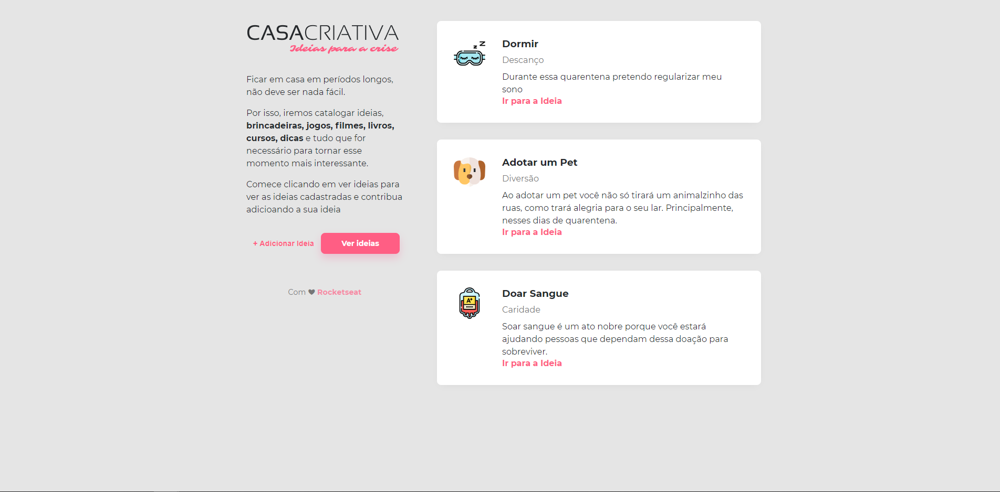
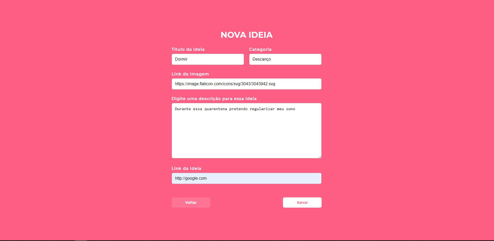
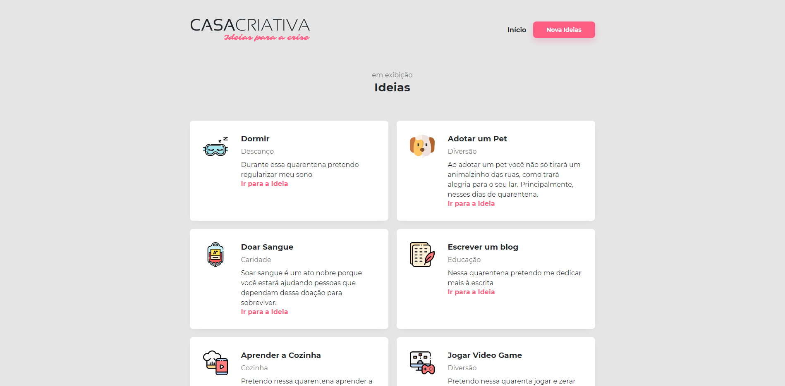

# Casa-criativa-workshop-dev :rocket:
 Repositório responsável por armazenar o projeto desenvolvido durante o **Workshop Dev** promovido pela *rocketseat*.

## Casa Criativa :closed_book:

A **Casa Criativa** é uma aplicação para armazenar ideias para fazer durante a crise. O usuário pode cadastrar uma nova ideia, adicionar um ícone, descrição e link a ela. No fim, o usuário pode visualizar todas as ideias cadastradas.

## Tecnologias utilizadas :computer:

* Front-end:
   * Html
   * CSS
   * JavaScript

* Back-end:
   * Node
   * Sqlite3
   * Nunjucks

## Como rodar :rocket:

1. Clone o repositório
1. Rode o comando `npm install`
1. Execute o `npm start`
1. Abra o navegador no `http://localhost:3000`
